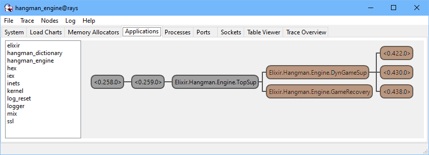

# Hangman Engine

Models the _Hangman Game_.

##### Based on the course [Elixir for Programmers](https://codestool.coding-gnome.com/courses/elixir-for-programmers) by Dave Thomas.

## Installation

Add `hangman_engine` to your list of dependencies in `mix.exs`:

```elixir
def deps do
  [
    {:hangman_engine, "~> 0.1"}
  ]
end
```

## Supervision Tree

The highlighted processes below (supervisor and servers) are fault-tolerant:
if any crashes (or is killed), it is immediately restarted and the system
remains undisturbed.

The processes identified by their PIDs are game servers: each holds a game
struct as its state. Multiple games can be played simultaneously.

## 

## Note

Package [Hangman Text Client](https://hex.pm/packages/hangman_text_client) uses
`hangman_engine` as a dependency to play the _Hangman Game_ in the console.
